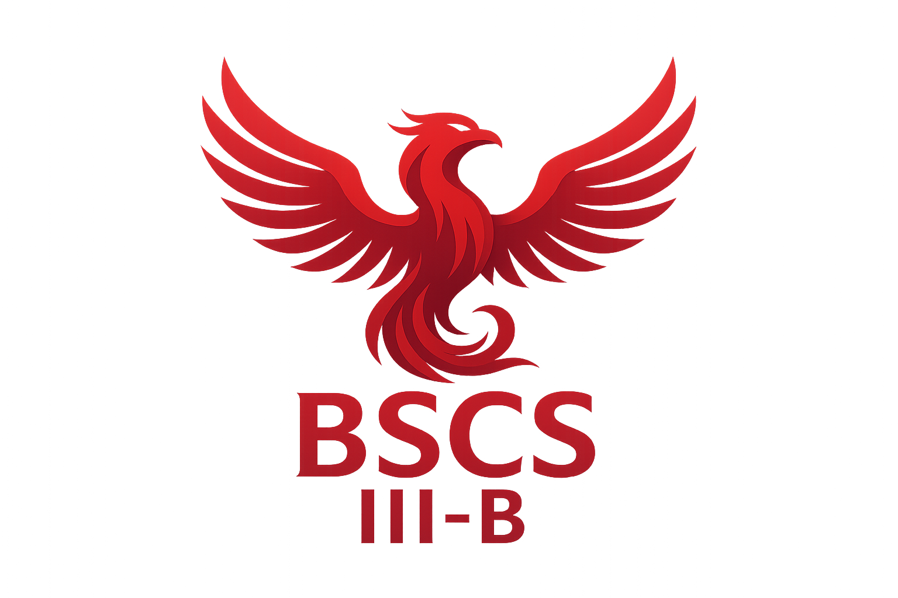

# Advance Study Portal

## Course Subjects and Files

This repository contains study materials for the following courses:

### Available Course Materials

1. **Automata Theory and Formal Language**
   - File: `automata theory and formal language/12_2023_10_08!04_27_43_PM.pdf` (570 KB)

2. **Computer Engineering 1**
   - File: `CompEng1/unit1.pdf` (859 KB)

3. **Computational Science**
   - File: `Computational Science/x2j4Q8_intro computational science.pdf` (11.8 MB)

4. **Data Communication and Network**
   - File: `Data Communication and Network/dcn.pdf` (3.1 MB)

5. **Intelligence System**
   - File: `Intelligence System/IntelligentSystems.pdf` (329 KB)

6. **Operating System**
   - File: `OS/R20CSE2202-OPERATING-SYSTEMS.pdf` (4.6 MB)

7. **System Fundamentals**
   - File: `System Fundamentals/topic-1.1_system_fundamentals.pdf` (1029 KB)

## Note
These materials are provided for advanced study and reference purposes only. Happy studying!